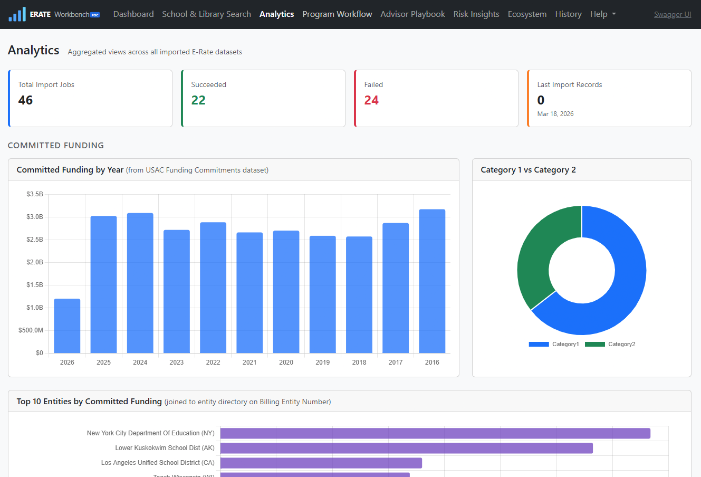
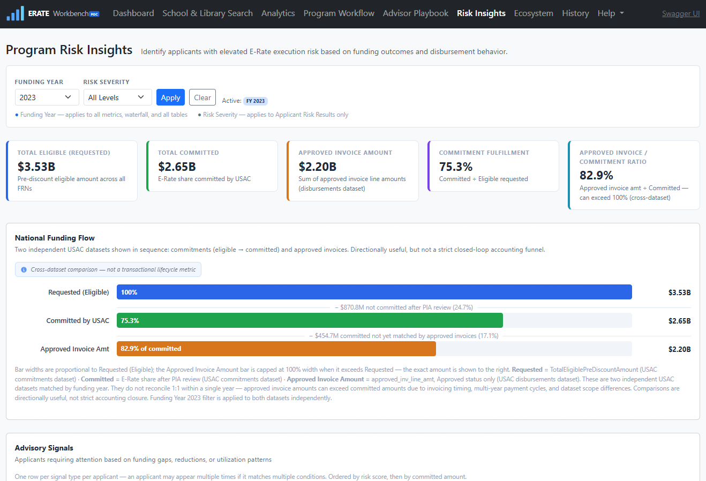
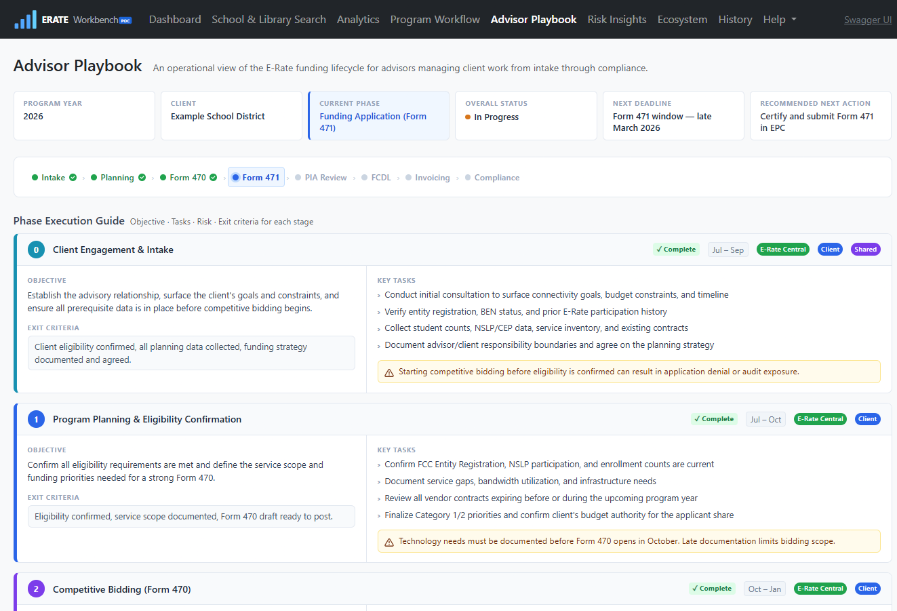
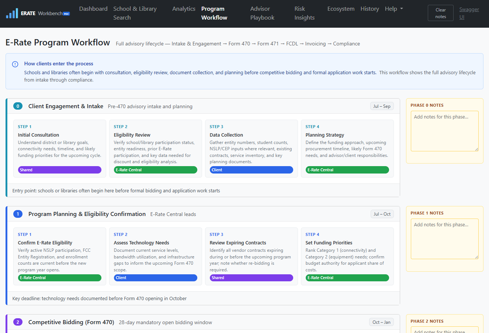
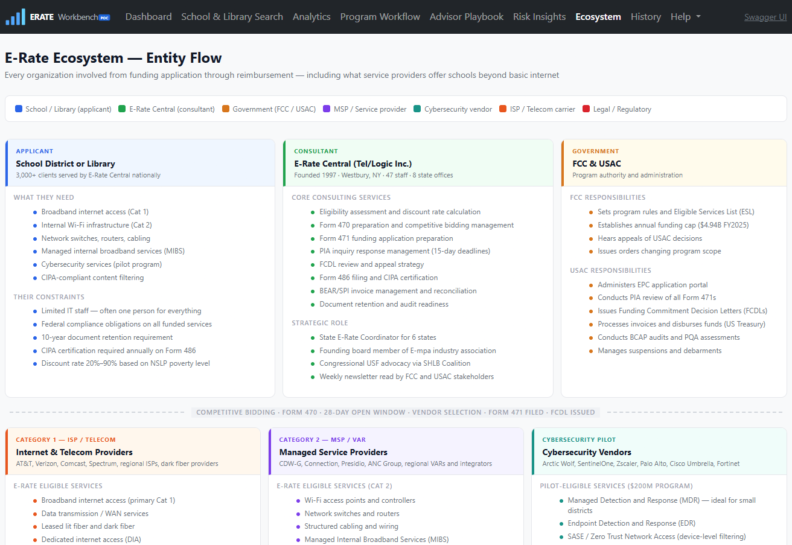
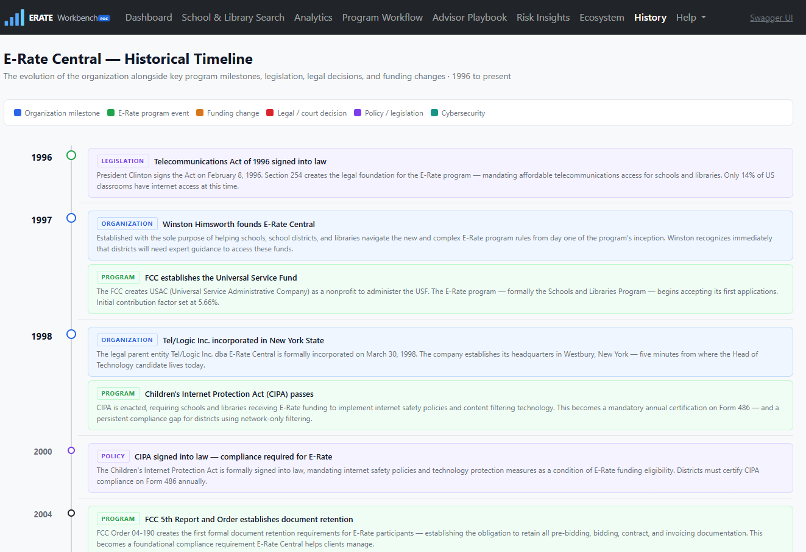

# ERATE Workbench

ERATE Workbench is a proof-of-concept analytics platform for exploring USAC E-Rate open data. It ingests publicly available datasets, normalizes them into a local SQLite database, and provides search, analytics, risk insights, and reference content through an ASP.NET Core Razor Pages UI and REST API.

> [!IMPORTANT]
> This repository is a proof of concept and is **not** an official USAC or FCC product.
> It is intended for exploration, prototyping, and engineering discussion.
> **Current State: Project is paused while working on Home MCP platform/control plane project.**

---
## Quick start

### Prerequisites

* .NET 8 SDK
* WSL2 (Ubuntu) recommended on Windows
* `lsof` and `curl` (used by dev scripts)

### Run locally

```bash
./scripts/dev-run.sh
```

Then open:
`http://localhost:5000`

* The database is created automatically on first run via EF Core migrations
* A fresh local database starts empty
* Use the import endpoints in Swagger UI at `/swagger` to load data

---

## Features

* Search across 250k+ schools, libraries, and districts (USAC entity directory)
* Explore funding commitments and disbursement-related analytics by year
* Review applicant-level advisory risk indicators
* Browse reference content:

  * Program Workflow
  * Ecosystem Map
  * E-Rate Historical Timeline
* Test all API endpoints via Swagger UI (`/swagger`)

---

## Data pipeline

* Imports four USAC-backed datasets:

  * Entity Directory (EPC)
  * Funding Commitments
  * Service Providers (SPIN)
  * Form 471 Applications
* Idempotent ETL — safe to re-run without duplicating data
* Data normalized into a local SQLite database
* EF Core migrations automatically provision schema

---

## Importing data

A new local database starts empty. Use Swagger UI (`/swagger`) to trigger imports:

| Dataset                     | Endpoint                           |
| --------------------------- | ---------------------------------- |
| USAC Entity Directory (EPC) | `POST /import/usac`                |
| Funding Commitments         | `POST /import/funding-commitments` |
| Service Providers (SPIN)    | `POST /import/service-providers`   |
| Form 471 Applications       | `POST /import/form471`             |

* Imports page through full datasets and may take several minutes
* All imports are idempotent and safe to re-run

---

## Local development

### Validate (restore → build → test)

```bash
./scripts/dev-run.sh --validate
```

### Run UI smoke tests

```bash
./scripts/ui-test.sh
```

If the app is already running:

```bash
./scripts/ui-test.sh --app-running
```

### Playwright setup (WSL / Ubuntu)

```bash
sudo apt-get install -y libnss3 libnspr4 libasound2t64
~/.dotnet/tools/playwright install chromium
```

(Handled automatically in GitHub Actions CI)

See [`docs/devops/local-workflow.md`](docs/devops/local-workflow.md) for details.

---

## CI pipeline

Runs on every push and pull request:

* Build
* Test
* UI smoke tests (Playwright, headless Chromium)
* Security scan (NuGet vulnerabilities)
* Secrets scan (gitleaks)
* Publish (self-contained linux-x64 artifact)

See [`docs/devops/pipeline.md`](docs/devops/pipeline.md).

---

## Releases

Releases are created manually via:

**GitHub → Actions → Release → Run workflow**

* Builds and packages the app
* Publishes a GitHub Release
* Attaches a self-contained `linux-x64` binary

See [`docs/devops/release.md`](docs/devops/release.md).

---

## DevSecOps controls

| Control                       | Tool                               | Behavior                                 |
| ----------------------------- | ---------------------------------- | ---------------------------------------- |
| Dependency vulnerability scan | `dotnet list package --vulnerable` | Fails on vulnerable direct packages      |
| Secrets scanning              | gitleaks                           | Fails on detected secrets in git history |
| Dependency updates            | Dependabot                         | Weekly PRs                               |

**Dependabot strategy:**

* Patch/minor → merge after CI passes
* Test/tooling → review CI output, merge if green
* Major upgrades → deliberate testing required
* Keep PR queue small

---

## Repository structure

* `src/ErateWorkbench.Api` — ASP.NET Core app, Razor Pages UI, API endpoints
* `src/ErateWorkbench.Domain` — domain logic and shared rules
* `tests/ErateWorkbench.Tests` — unit and integration-style tests
* `docs/` — architecture, DevOps, and reference documentation
* `scripts/` — local development and automation scripts

---

## Known limitations

* Data freshness depends on manual imports
* Risk indicators are heuristic and advisory only
* SQLite is used for portability, not high-concurrency workloads
* Playwright UI tests require system dependencies (WSL/Linux)

---

## Screenshots

A few views from the current ERATE Workbench UI:

### Analytics Dashboard
<p>
  
</p>
Explore funding commitments over time, compare entities, and analyze program-wide trends.

---

### Risk Insights
<p>
  
</p>
Review applicant-level advisory signals designed to highlight potential execution risks, including safeguards for partial-year data interpretation.

---

### Advisory Playbook
<p>
  
</p>
Translate risk signals into actionable guidance using structured advisory context.

---

### Program Workflow
<p>
  
</p>
Understand the end-to-end E-Rate process from application through funding and disbursement.

---

### E-Rate Ecosystem
<p>
  
</p>
Visual overview of the stakeholders, systems, and relationships that make up the E-Rate program.

---

### Historical Timeline
<p>
  
</p>
Browse the evolution of the E-Rate program through key milestones and policy changes.

---
## Data Sources

This project uses publicly available datasets published by the Universal Service Administrative Company (USAC) as part of the FCC E-Rate program.

Primary datasets include:

- **Form 471 Applications (Basic Information)**  
  https://datahub.usac.org/E-rate/E-rate-Form-471-Application-Data/9s6i-myen

- **Funding Commitments**  
  https://datahub.usac.org/E-rate/E-rate-Funding-Commitments

- **Entity Directory (EPC)**  
  https://datahub.usac.org/E-rate/E-rate-Entity-Directory

- **Service Providers (SPIN)**  
  https://datahub.usac.org/E-rate/E-rate-Service-Providers

These datasets are accessed via the Socrata Open Data API and ingested into a local SQLite database for analysis.

## Licensing & Data Use

USAC datasets are publicly available and provided for transparency and analysis of the E-Rate program.

This project:

- Uses USAC data in accordance with its public/open data availability
- Does not modify source records beyond normalization for analytics
- Is intended for analytical and advisory exploration purposes only

This repository is not affiliated with or endorsed by USAC or the FCC.

Users should refer to USAC for official program data and guidance:
https://www.usac.org/

## Contributing

Contributions are welcome. For larger changes, open an issue first to discuss scope and approach.
